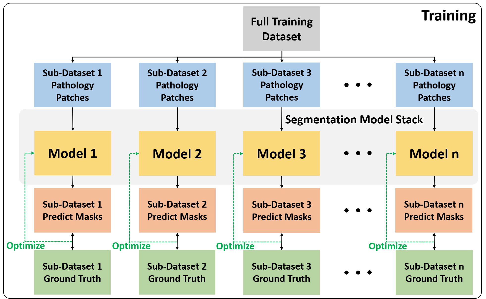
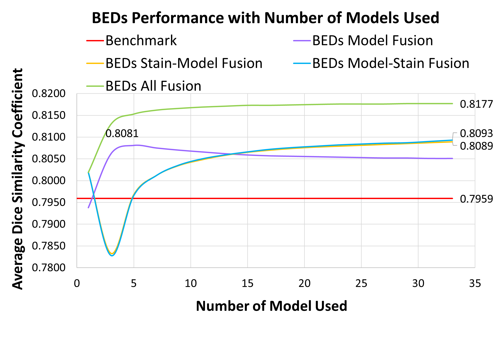
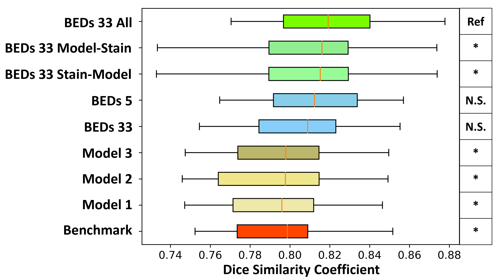
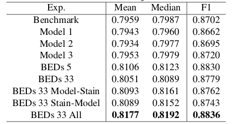

# BEDs
Tensorflow based implementation of BEDs as described in BEDs: Bagging Ensemble Deep Segmentation for Nucleus Segmentation with Testing Stage Stain Augmentation by Xing Li, Haichun Yang, Jiaxin He, Aadarsh Jha, Agnes B. Fogo, Lee E. Wheless, Shilin Zhao and Yuankai Huo.

The proposed method is shown in figure below:
| Training | Testing |
|----------|---------|
|||

The performance overview for the proposed method is shown in figure below:


## Setup
This repo tested in following environment:
```bash
python==3.5.2
tensorflow-gpu==1.12.0
opencv-python==3.4.0.14
```
To setup the python environment for this project, run:
```bash
pip install -r requirements.txt
```
Follow the procedure below to setup and download necessary data to reproduce the results in the paper.
1. Clone this repository.
2. Create directory for datasets.
```bash
mkdir datasets
cd datasets
mkdir Train Val Test
```
3. Download training dataset from [manually labeled dataset](https://app.box.com/s/fz425ixs15kf56ghbnpxng1es6m7v2oh): Dataset of segmented nuclei in hematoxylin and eosin stained histopathology images of ten cancer types. Extract to `datasets/Train`. Put `*_crop.png` to `datasets/Train/Images` and `*_labeled_mask_corrected.png` to `datasets/Train/Annotations`.
3. Download validation dataset from [MoNuSeg Challenge 2018 (Training)](https://drive.google.com/file/d/1JZN9Jq9km0rZNiYNEukE_8f0CsSK3Pe4/view). Extract to `datasets/Val`. Rename the directory `Tissue Images` to `Images`
4. Download testing dataset from [MoNuSeg Challenge 2018 (Testing)](https://drive.google.com/file/d/1NKkSQ5T0ZNQ8aUhh0a8Dt2YKYCQXIViw/view). Extract to `datasets/Test`. Put `.tif` files to `datasets/Test/Images` and `.xml` files to `datasets/Test/Annotations`.
5. (Optional) Download our stain augmented testing images [here](https://drive.google.com/file/d/1VvFbE0kKD85rLZjK0T1L4Rh0NR4Xfbt7/view?usp=sharing). Extract to `datasets/Test`
6. (Optional) Download our pre-trained models [here](https://drive.google.com/file/d/13mx5xXMtHRQ7iUJuPJCtnL9RaV_2vW2y/view?usp=sharing). Extract to `BEDs`.

## Data Processing

After following the steps in Setup, run following script to:
```bash
cd BEDs/
```
1. Generate benchmark and random split training data for U-net training:
```bash
python data_process/prepare_datasets.py --annot-dir datasets/Train/Annotations/ --output-dir datasets/Train/deep_forest/ --stage train --subset-num 33 datasets/Train/Images/
```
2. Generate validation data:
```bash
python data_process/prepare_datasets.py --annot-dir datasets/Val/Annotations/ --output-dir datasets/Val/Val/ --stage val datasets/Val/Images/
```
3. Generate testing data for each type of stain augmentation (0 is the original stain, 1-6 is the augmented stain):
```bash
python data_process/prepare_datasets.py --annot-dir datasets/Test/Annotation/ --output-dir datasets/Test/Test_pairs/0/ --stage test datasets/Test/Images_stainNormed/0/
```
Or can simply run:
```bash
. prepare_testdata.sh
```
to prepare all testing images.

## Inference with pre-trained models
If Step 6 in Setup and Step 3 in Data Processing was successfully done, run the following command to do inference for BEDs:
```bash
cd eval
python BEDs_inference.py --model-dir ../models/deep_forest/ --output-dir ../experiments/BEDs_inference_results/ ../datasets/Test/Test_pairs/
```
The system would take a while to inference 7 difference stain augmentation with 33 models.

## Experiments and Evaluation
The ablation study, in the figure below, showed that the self-ensemble learning and testing stage stain augmentation were mutually complementary. Herein, the holistic model achieved the highest mean and median DSC, without using any extra training data:
| Ablation Study | Distribution Boxplot |
|----------------|----------------------|
|||

After obtained the BEDs inference results in `experiments/BEDs_inference_results/`, following steps are followed to evaluate the performance reported in paper.

### Experiments & Pixel-wise Evaluation

1. Benchmark: `python benchmark_eval.py --nuclei-model ../models/benchmark/frozen_model.pb --output-dir ../experiments/benchmark/ ../datasets/Test/Test_pairs/0/`
2. Model 1, 2, 3 (Single Model): `python benchmark_eval.py --nuclei-model ../models/deep_forest/RANDOM_MODEL/frozen_model.pb --output-dir ../experiments/RANDOM_MODEL/ ../datasets/Test/Test_pairs/0/`
3. BEDs 5: `python BEDs_eval.py --model-dir ../models/deep_forest/ --output-dir ../experiments/BEDs_inference_results/ --fusion-dir ../experiments/fusing_results/ --experiments BEDs_Model --model_num 5 ../datasets/Test/Test_pairs/0/`
4. BEDs 33: `python BEDs_eval.py --model-dir ../models/deep_forest/ --output-dir ../experiments/BEDs_inference_results/ --fusion-dir ../experiments/fusing_results/ --experiments BEDs_Model --model_num 33 ../datasets/Test/Test_pairs/0/`
5. BEDs 33 Model-Stain: `python BEDs_eval.py --model-dir ../models/deep_forest/ --output-dir ../experiments/BEDs_inference_results/ --fusion-dir ../experiments/fusing_results/ --experiments BEDs_Model-Stain --model_num 33 ../datasets/Test/Test_pairs/0/`
6. BEDs 33 Stain-Model: `python BEDs_eval.py --model-dir ../models/deep_forest/ --output-dir ../experiments/BEDs_inference_results/ --fusion-dir ../experiments/fusing_results/ --experiments BEDs_Stain-Model --model_num 33 ../datasets/Test/Test_pairs/0/`
7. BEDs 33 All: `python BEDs_eval.py --model-dir ../models/deep_forest/ --output-dir ../experiments/BEDs_inference_results/ --fusion-dir ../experiments/fusing_results/ --experiments BEDs_All --model_num 33 ../datasets/Test/Test_pairs/0/`

### Object-wise Evaluation
To compute the objectwise F1 for each experiment, run:
```bash
python objectwise_DSC_eval.py --ref-dir ../datasets/Test/Test_GT/ --input-dir ../experiments/fusing_results/EXPERIMENT_DIR/ --output-dir ../experiments/objectwise_F1/EXPERIMENT_DIR/
```

By following the procedure above, we obtained the following experiment results:


## Train U-net by yourself
The U-net implementation used in this project is modified based on the encoder-decoder network with skip connection in [pix2pix](https://github.com/affinelayer/pix2pix-tensorflow). A validation during training option is added to the original work. If a validation path is defined, the training script will save the best model based on evaluation on the validation dataset. Otherwise, only the lastest model will be saved. If Step 1 & 2 in Data Processing was successful, the model can be trained using `train_unet.py`.
For example, to train the benchmark:
```bash
python train_unet.py --input_dir datasets/Train/deep_forest/benchmark/train/ --val_dir datasets/Val/Val/ --mode train --output_dir checkpoints/unet_ckpts/benchmark/ --max_epochs 30 --summary_freq 1356 --save_freq 1356 --display_freq 5424 --scale_size 256
```
To train the model with sub-dataset:
```bash
python train_unet.py --input_dir datasets/Train/deep_forest/RANDOM_MODEL/train/ --val_dir datasets/Val/Val/ --mode train --output_dir checkpoints/unet_ckpts/RANDOM_MODEL/ --max_epochs 30 --summary_freq 904 --save_freq 904 --display_freq 4520 --scale_size 256
```
Or can simply run:
```bash
. deep_forest_train.sh
```
During training, the process can be monitored with `tensorboard`:
```bash
tensorboard --logdir checkpoints/unet_ckpts/deep_forest/RANDOM_MODEL/
```

### Freeze the models and prepare for inference
After all the training are done, one can export and freeze the model with the tools provided in this package:
```bash
python tools/reduce_model.py --model-input checkpoints/unet_ckpts/deep_forest/MODEL_DIR/ --model-output checkpoints/unet_ckpts/deep_forest/MODEL_DIR/
python tools/freeze_model.py --model-folder checkpoints/unet_ckpts/deep_forest/MODEL_DIR/
```
Or can simply run:
```bash
. freeze_model.sh
```
